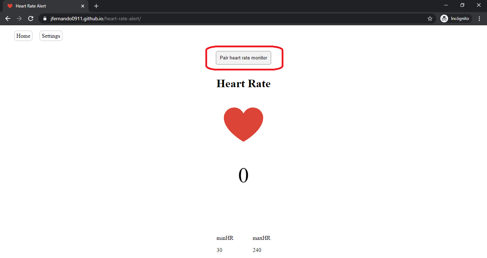
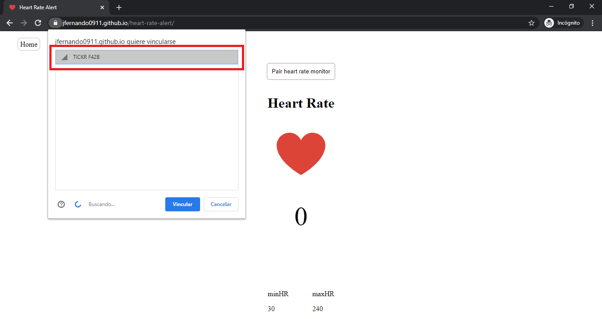
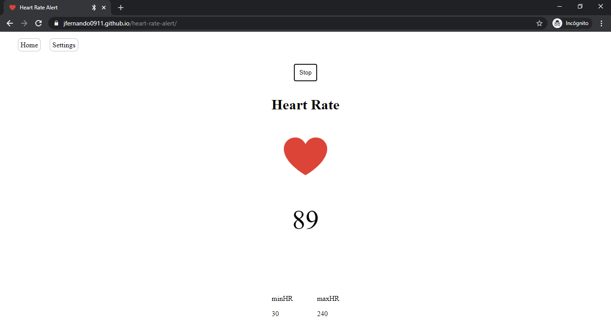

❤

### Heart Rate Zone Alert PWA

Heart Rate Alert is a PWA (Progressive Web App) using web technologies that tracks a treshhold of your heart rate. You can set your settings to alert you with a sound if your heart rate is below, in or upper the ranges you specify. For example, you can set your max treshhold to be 146 and your min treshhold to be 136 making your range to be between 146 and 136, and it will make an alert sound if you are below 136, upper 146, it will tell you if you are in between, also.

## Technologies used

* Gatsby
* Reactjs
* SCSS
* IndexedDB API

## Devices needed to track your heart rate

*  
*  

## Steps to use it

* Be sure your bluetooth is turned on
* Go to https://jfernando0911.github.io/heart-rate-alert/
* If you are on windows, be sure to pair your heart rate monitor strap first.
* Click on pair heart rate monitor
    *  
* A popup menu with the bluetooth devices will show up
    *  
* Once paired it will start tracking your heart
    *  

## Compatibility with iOS and Android

* The android version must be greater than 6 (Marshmallow)
* It is still not compatible with iOS for the moment
* For more information about the compatibility of the [web bluetooth API](https://github.com/WebBluetoothCG/web-bluetooth/blob/master/implementation-status.md) 

